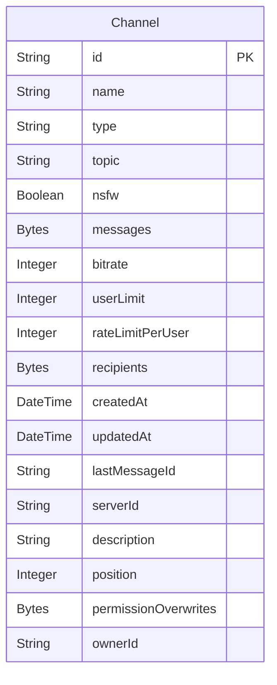

Channels can have several fields, including:


:::note
There are also other fields (one-to-many, many-to-many relationships) not listed here.  
To see the full schema, you can check the [database schema](/development/database).
:::

## Endpoints

Below is the list of endpoints related to channels.

:::warning
All channel-related endpoints are protected by the authentication middleware.  
You must provide a valid token in the `Bearer` header to access them.  
See the [authentication](/api/authentication) page for more information.
:::

---

### Get channel: `GET /api/channels/:id`

This endpoint allows you to get a channel by its id.

#### Parameters

- `id`: The id of the channel (string), *(required)*

#### Body

Takes no body.

#### Response

- `200`: The channel object (see the [channel dto](/development/dto/channel) for more information)

  
(*needs login*)

---

### Get all channels: `GET /api/channels`

This endpoint allows you to get all channels.

:::warning
This endpoint is only available for the admin.
:::

#### Parameters

Takes no parameters.

#### Response

- `200`: An array of channel objects (see the [channel dto](/development/dto/channel) for more information)

  
(*needs login* and *admin privileges*)

---

### Update channel: `PATCH /api/channels/:id`

This endpoint allows you to update a channel by its id.

#### Parameters

- `id`: The id of the channel (string), *(required)*

#### Body

It takes in its body the fields that you want to update (any fields from the [channel dto](/development/dto/channel)).  
For instance, if you want to update the name, you can send the following body:
```json
{
    "name": "newName"
}
```

#### Response

- `200`: A string that says "Channel updated successfully" *(or something similar)*

  
(*needs login*)

---

### Delete channel: `DELETE /api/channels/:id`

This endpoint allows you to delete a channel by its id.

#### Parameters

- `id`: The id of the channel (string), *(required)*

#### Body

Takes no body.

#### Response

- `200`: A string that says "Channel deleted successfully" *(or something similar)*

  
(*needs login*)

---

### Create channel: `POST /api/channels`

This endpoint allows you to create a new channel.

#### Parameters

Takes no parameters.

#### Body

It takes in its body the fields required to create a channel (any fields from the [channel dto](/development/dto/channel)).  
For instance, to create a new channel, you can send the following body:
```json
{
    "name": "general",
    "type": "DM",
    "topic": "This is a general channel",
    "nsfw": false,
    "bitrate": 64000,
    "userLimit": 10,
    "rateLimitPerUser": 10,
    "recipients": [],
    "serverId": "37963246-7e9d-4239-a95f-96704c6dcbaa",
    "description": "This is a general channel"
}
```

#### Response

- `201`: A string that says "Channel created successfully" *(or something similar)*

  
(*needs login*)

---

### Add recipients to channel: `POST /api/channels/:id/recipients`

This endpoint allows you to add recipients to a channel by its id.

#### Parameters

- `id`: The id of the channel (string), *(required)*

#### Body

It takes in its body the recipients to add (array of recipient ids).

#### Response

- `200`: A string that says "Recipients added successfully" *(or something similar)*

  
(*needs login*)

---

### Remove recipients from channel: `DELETE /api/channels/:id/recipients`

This endpoint allows you to remove recipients from a channel by its id.

#### Parameters

- `id`: The id of the channel (string), *(required)*

#### Body

It takes in its body the recipients to remove (array of recipient ids).

#### Response

- `200`: A string that says "Recipients removed successfully" *(or something similar)*

  
(*needs login*)
