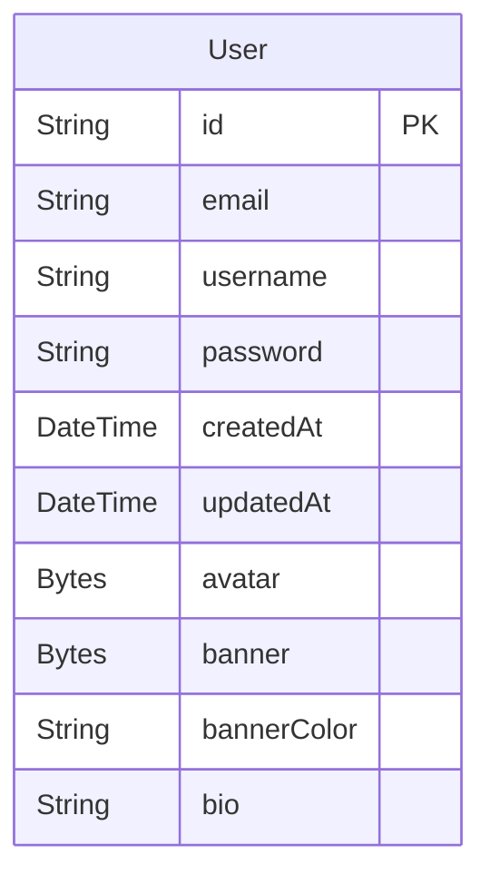

The user can be composed of several fields. Here is the list of the fields that a user can have:


:::note
There are also a lot of other fields (one-to-many, many-to-many relationships) that are not listed here.  
If you want to see the full schema, you can check the [database schema](/development/database).
:::

## Endpoints

In the following, you will find the list of the endpoints that are related to the user.

:::warning
All user-related endpoints are protected by the authentication middleware.  
You'll need to provide a valid token in the `Bearer` header to access them.  
See the [authentication](/api/authentication) page for more information.
:::

---

### Get user : `GET /user/:id`

This endpoint allows you to get a user by its id.

#### Parameters

- `id` : The id of the user (string), \*(required)

#### Body

Takes no body.

#### Response

- `200` : The user object (see the [user dto](/development/dto/user) for more information)

  
(*needs login*)

---

### Get all users : `GET /users`

This endpoint allows you to get all the users.

:::warning
This endpoint is only available for the admin.
:::

#### Parameters

Takes no parameters.

#### Response

- `200` : An array of user objects (see the [user dto](/development/dto/user) for more information)

  
(*needs login* and *admin privileges*)

---

### Update user : `PATCH /user/:id`

This endpoint allows you to update a user by its id.

#### Parameters

- `id` : The id of the user (string), \*(required)

#### Body

It takes in its body the fields that you want to update (any fields from the [user dto](/development/dto/user)).  
For instance, if you want to update the username, you can send the following body:
```js
{
    "username": "newUsername"
}
```

#### Response

- `200` : A string that says "User updated successfully" *(or something like that)*

  
(*needs login*)

---

### Delete user : `DELETE /user/:id`

This endpoint allows you to delete a user by its id.

#### Parameters

- `id` : The id of the user (string), \*(required)

#### Body

Takes no body.

#### Response

- `200` : A string that says "User deleted successfully" *(or something like that)*

  
(*needs login*)
